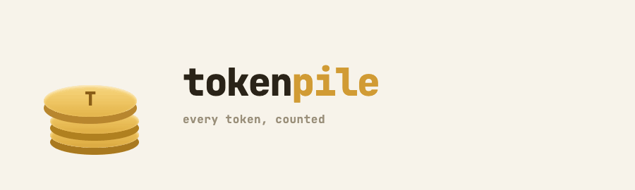
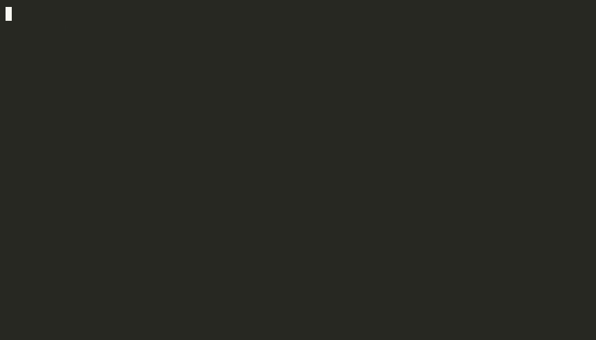

<p align="center">
  
</p>

<p align="center">
  <a href="https://github.com/CDimonaco/tokenpile/actions/workflows/ci.yml"></a>
  <a href="https://github.com/CDimonaco/tokenpile/releases/latest"></a>
  <a href="https://github.com/CDimonaco/tokenpile/blob/main/go.mod"></a>
  <a href="https://github.com/CDimonaco/tokenpile/blob/main/LICENSE"></a>
  <a href="https://github.com/CDimonaco/homebrew-tap/blob/main/Formula/tokenpile.rb"></a>
  <a href="https://github.com/CDimonaco/tokenpile/actions/workflows/codeql.yml"></a>
</p>

Track LLM token usage and cost per GitHub issue. Any agent (Claude Code, OpenCode, Cursor, or your own tooling) calls the CLI to log usage; you browse a TUI to see where time and money went.

<p align="center">
  
</p>

## Features

- Log token usage from any LLM agent via a single CLI call
- Validates the GitHub issue exists before logging — no phantom entries
- Track by agent name and model separately (e.g. `claude-code` running `claude-sonnet-4-6`)
- Sessions with 30-minute idle auto-close for wall-clock time tracking
- Annotate sessions with a `--note` and one or more `--tag` labels per log call; tags accumulate across calls in the same session
- Per-issue spending budget with `tokenpile budget set`; report shows consumed vs. total percentage
- GitHub issue metadata (title, labels, URL) cached in the local DB at log time
- TUI: issue list with clickable `#N` OSC 8 hyperlinks, per-issue detail with Summary and Sessions tabs, budget progress bar (green/yellow/red), token usage chart over time
- Open issues in the browser with `o`, refresh cached metadata with `r`
- Report and export include issue title and labels
- Ed25519-signed JSON export (schema v3) with sessions and budgets blocks; the signature covers the whole document
- Pricing config with built-in defaults and per-model overrides
- SQLite storage — local, no external services required

## Installation

### Homebrew (macOS / Linux)

```sh
brew install cdimonaco/tap/tokenpile
```

### From source

Prerequisites: Go 1.25+

```sh
git clone https://github.com/cdimonaco/tokenpile
cd tokenpile
make install
```

This installs the binary to `$GOPATH/bin`. Make sure that is on your `PATH`.

To build without installing:

```sh
make build
# produces ./tokenpile
```

## Quick start

### 1. Authenticate with GitHub

```sh
tokenpile auth login --provider github
```

This opens a browser window for OAuth. The token is stored in your OS keychain (or an encrypted file on headless Linux).

### 2. Install the skill for your agent

```sh
tokenpile skill install --agent claude-code    # writes ~/.claude/skills/tokenpile/SKILL.md
tokenpile skill install --agent codex          # appends a block to ~/.codex/AGENTS.md
tokenpile skill install --agent opencode       # appends a block to ~/.config/opencode/AGENTS.md
```

After installation, the agent will automatically call `tokenpile log` at the end of each response where significant work was done.

For **codex** and **opencode**, the skill is appended to their shared `AGENTS.md` file using HTML comment markers (`<!-- tokenpile:start -->` / `<!-- tokenpile:end -->`). Your existing instructions are never touched. Running the command again updates only the tokenpile block in place.

See `tokenpile skill list` for supported agents and their installation status.

### 3. Or log manually

```sh
tokenpile log \
  --issue 42 \
  --agent claude-code \
  --model claude-sonnet-4-6 \
  --tokens-in 12000 \
  --tokens-out 3000 \
  --note "refactored auth middleware" \
  --tag refactor --tag feature
```

`--repo` is optional if you run from inside a git repository with a GitHub remote. Otherwise pass it explicitly:

```sh
tokenpile log --issue 42 --agent claude-code --model claude-sonnet-4-6 \
  --tokens-in 12000 --tokens-out 3000 --repo owner/repo
```

### 4. Browse the TUI

```sh
tokenpile
```

**Issue list**

| Key | Action |
|-----|--------|
| `j` / `k` | navigate up/down |
| `enter` | open issue detail |
| `o` | open selected issue in browser |
| `c` | open chart view |
| `esc` | go back |
| `?` | toggle help |
| `q` | quit |

The list shows a clickable `#N` link for each issue. In terminals that support OSC 8 hyperlinks (iTerm2, Kitty, most modern terminals) clicking the link opens the issue in your browser.

**Issue detail**

| Key | Action |
|-----|--------|
| `tab` | switch between Summary and Sessions tabs |
| `o` | open issue in browser |
| `r` | refresh title and labels from GitHub |
| `c` | open chart view |
| `esc` | go back |
| `d` / `w` | day / week granularity (chart) |
| `q` | quit |

## Commands

### `tokenpile log`

Record token usage for an issue.

```sh
tokenpile log --issue <num> --agent <name> --model <model> \
  --tokens-in <n> --tokens-out <n> [--repo owner/repo] \
  [--note "description"] [--tag <tag> ...]
```

| Flag | Description |
|------|-------------|
| `--note` | Short description of what was done in this call (last-write-wins per session) |
| `--tag` | Label for the call; repeatable. Tags accumulate across calls in the same session (union). |

Sessions are managed automatically. The first call for an `(issue, repo)` pair starts a session; subsequent calls within 30 minutes of the previous log reuse it. After 30 minutes of inactivity since the last log call the session is closed and a new one starts on the next call.

The log command validates that the issue exists on GitHub before inserting the entry. If the issue is not found, the command fails with an error. Issue title and labels are cached in the local DB for use in reports, exports, and the TUI.

### `tokenpile report`

Print a per-(agent, model) breakdown for an issue. The header shows the issue title, URL, and labels if they are in the local cache.

```sh
tokenpile report --issue 42
tokenpile report --issue 42 --repo owner/repo
tokenpile report --issue 42 --sessions          # also print a per-session breakdown
```

If a budget is set for the issue, the report shows total consumed vs. budget and the percentage used.

The `--sessions` flag adds a session list showing start/end time, duration, tags, and note for each session.

### `tokenpile budget`

Set or remove a spending budget for an issue.

```sh
tokenpile budget set --issue 42 --amount 10.00      # set $10 budget
tokenpile budget set --issue 42 --amount 10.00 --repo owner/repo
tokenpile budget unset --issue 42                   # remove the budget
```

Once a budget is set, `tokenpile report` shows the consumed amount alongside the budget, and the TUI issue list shows a colour-coded budget bar (green below 80%, yellow 80–99%, red at or above 100%).

### `tokenpile auth`

```sh
tokenpile auth login  --provider github   # open browser, store token
tokenpile auth logout --provider github   # remove stored token
tokenpile auth status                     # show login state
```

### `tokenpile pricing`

```sh
tokenpile pricing list                                        # show merged config
tokenpile pricing set my-model --in 1.50 --out 6.00          # add/override a model
```

Prices are per million tokens. Built-in defaults cover the most common Claude, GPT, and Gemini models. User overrides are stored at `~/.config/tokenpile/pricing.yaml` and take precedence.

### `tokenpile export`

Export usage data as an Ed25519-signed JSON document (schema v3).

```sh
tokenpile export                              # all data, to stdout
tokenpile export --output data.json          # write to file
tokenpile export --repo owner/repo --issue 42 --agent claude-code
tokenpile export --from 2026-01-01T00:00:00Z --to 2026-07-01T00:00:00Z
```

Sessions and budgets follow the same repo/issue scope as the entries filter: an unfiltered export includes all sessions and budgets, `--repo` scopes them to the repository, `--repo --issue` to the single issue. The Ed25519 signature covers the whole document (canonical JSON with the `signature` field emptied), so tampering with any field fails verification. Legacy schema v2 files still verify with a warning: their signature covers entries only.

Verify a previously exported file:

```sh
tokenpile export verify --file data.json
tokenpile export verify --file data.json --pubkey ~/.config/tokenpile/identity.pub
```

Without `--pubkey` the check proves internal consistency against the key embedded in the document. Pass `--pubkey` (base64 string or path to a PEM/base64 file) to also prove the export was signed by the expected identity.

### `tokenpile reset`

Back up everything to a signed export, then delete all local tokenpile state: database, identity keypair, credentials, keychain token, pricing override, and installed agent skills.

```sh
tokenpile reset                               # interactive: lists what will be deleted, asks to type 'yes'
tokenpile reset --yes                         # no prompt (for scripts)
tokenpile reset --yes --output backup.json    # choose the backup path
tokenpile reset --yes --no-backup             # skip the backup
```

The backup is a standard signed export (schema v3) written to `tokenpile-backup-<timestamp>.json` by default, so it can be verified later with `tokenpile export verify`. It is written before anything is deleted; if it fails, nothing is removed.

### `tokenpile skill`

```sh
tokenpile skill list                          # show agents, install status, and skill version
tokenpile skill install --agent claude-code   # dedicated file: ~/.claude/skills/tokenpile/SKILL.md
tokenpile skill install --agent codex         # append/update block in ~/.codex/AGENTS.md
tokenpile skill install --agent opencode      # append/update block in ~/.config/opencode/AGENTS.md
```

`skill list` shows a Version column: "up to date" if the installed skill matches the current version, "outdated (vN)" if a newer version is available. Re-run `skill install` to upgrade.

For shared AGENTS.md targets (codex, opencode) the command prints a summary of what it did — whether it created the file, appended a new block, or updated an existing one — so you always know exactly what changed.

## Configuration

| Variable | Default | Description |
|---|---|---|
| `TOKENPILE_CONFIG_DIR` | `~/.config/tokenpile` | Config directory (overrides XDG) |
| `TOKENPILE_DATA_DIR` | `~/.local/share/tokenpile` | Data directory (overrides XDG) |
| `TOKENPILE_LOG_LEVEL` | `info` | Log level: `debug`, `info`, `warn`, `error` |
| `TOKENPILE_LOG_FORMAT` | `text` | Log format: `text` or `json` |
| `TOKENPILE_GITHUB_CLIENT_ID` | baked in | Override the built-in GitHub OAuth client ID (development only) |
| `TOKENPILE_GITHUB_CLIENT_SECRET` | baked in | Override the built-in GitHub OAuth client secret (development only) |

XDG base directories (`XDG_CONFIG_HOME`, `XDG_DATA_HOME`) are respected when the `TOKENPILE_*` overrides are not set.

On first run, an Ed25519 signing keypair is generated at `~/.config/tokenpile/identity.{key,pub}` (permissions 0600/0644).

## Contributing

### Prerequisites

Install [asdf](https://asdf-vm.com) and the plugins for Go, golangci-lint, goreleaser, and mockery:

```sh
asdf plugin add golang
asdf plugin add golangci-lint
asdf plugin add goreleaser
asdf plugin add mockery
asdf install          # reads .tool-versions and installs all pinned versions
```

### Build and test

```sh
make build      # build binary to ./tokenpile
make test       # run all tests with race detector
make lint       # run golangci-lint
make fmt        # format all Go files with gofmt
make generate   # regenerate mocks (requires mockery from asdf)
make clean      # remove build artifacts
```

CI runs `fmt` check, `lint`, and `test -race` on every push and pull request.

To test the GitHub auth flow locally, create your own OAuth App (GitHub → Settings → Developer settings → OAuth Apps) and set:

```sh
export TOKENPILE_GITHUB_CLIENT_ID=your_dev_client_id
export TOKENPILE_GITHUB_CLIENT_SECRET=your_dev_client_secret
```

Set the OAuth App callback URL to `http://127.0.0.1/callback`: the login flow listens on an ephemeral loopback port, and GitHub ignores the port when matching loopback redirect URLs.

These env vars override the baked-in values. Released binaries have the production credentials injected by goreleaser via ldflags — end users do not need to set anything.

### Project layout

```
cmd/tokenpile/        CLI entry point and composition root
internal/
  usage/              shared data types (Entry, Session, Report, ...)
  store/              Store interface + SQLite adapter
  provider/           AuthProvider, IssueProvider, Issue type, GitHub implementations
  pricing/            two-layer pricing config and cost computation
  export/             Ed25519-signed canonical JSON export
  skill/              embedded agent skill templates
  tui/                Bubble Tea TUI
  config/             XDG path resolution and Ed25519 identity management
  mocks/              generated mocks for unit tests
schema/               JSON Schema for the export document
```

### Conventions

- Conventional commits: `feat:`, `fix:`, `chore:`, `docs:`, `test:`, `refactor:`, `ci:`
- One logical change per commit.
- No emojis anywhere.
- All dependencies injected via constructors. No globals.
- `context.Context` is the first parameter of every function that does I/O.
- Package names describe what they contain, not architectural layers. No `domain`, `model`, or `dto`.
- See [CLAUDE.md](CLAUDE.md) for the full conventions reference.

### Adding a new agent skill

1. Add a template file at `internal/skill/templates/<agent-name>.md`.
2. Add the agent entry to the `agents` slice in `internal/skill/skill.go` with its `InstallPath` function. Set `Shared: true` if the target file is shared with other content (e.g. AGENTS.md) — the install will append/update a marker-delimited block instead of overwriting the file.
3. Add tests in `internal/skill/skill_test.go`.

### Running a subset of tests

```sh
go test ./internal/store/...         # store tests only
go test -run TestSQLiteStore ./...   # filter by name
go test -race -count=1 ./...         # disable test cache, enable race detector
```
